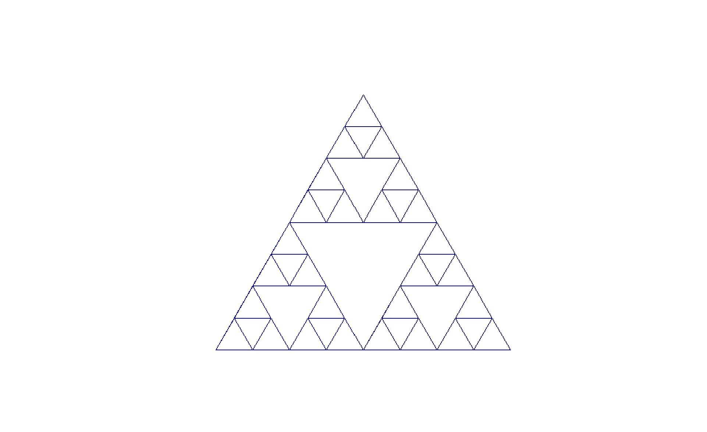

## توضیحات کد مثلث
<html>
<head>
    <h1 style=" color:blue; text-align:center;">توضیحات کد درخت</h1>
    <body>
    
     
    

    
ابتدا کتابخانه‌ی turtle را صدا می‌زنیم و تابع sierpinski() را تعریف می‌کنیم که دو پارامتر size و order را به عنوان ورودی می‌پذیرد.  Size طول ضلع مثلث و order نشان دهنده تعداد مرتبه‌ی تکرار است. در هر مرحله تابع طول ضلع مثلث را نصف می‌کند و آن را رسم می‌کند بعد از آن نیز تابع در سه جهت مختلف مثلث را به مرتبه‌ کمتر (order - 1) خودش را صدا می‌زند. در تابع main() اندازه‌ی صفحه و نقطه‌ی شروع رسم را مشخص می‌کنیم و بعد در آن تابع sierpinski() را صدا می‌زنیم.

    <h2 style=" color:blue; text-align:center;">کد درخت</h2>
    <pre>import turtle

        def sierpinski(order, size):
            if order == 0:
                for _ in range(3):
                    turtle.forward(size)
                    turtle.left(120)
            else:
                size /= 2
                turtle.color("darkblue")
                sierpinski(order - 1, size)
                turtle.forward(size)
                sierpinski(order - 1, size)
                turtle.backward(size)
                turtle.left(60)
                turtle.forward(size)
                turtle.right(60)
                sierpinski(order - 1, size)
                turtle.left(60)
                turtle.backward(size)
                turtle.right(60)
        
        def main():
            window = turtle.Screen()
            window.screensize(800, 600)
            turtle.speed(0)
            turtle.penup()
            turtle.goto(-200, -200)
            turtle.pendown()
        
            order = 3  
            size = 400  
            sierpinski(order, size)
        
            turtle.hideturtle()
            window.exitonclick()
        
        
        main()
    </pre>
    <a href="tree.html">کد درخت</a>
    

    </body>
</head>
</html>
---
**Test**: This is atest
