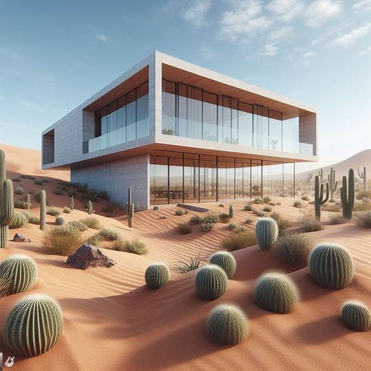
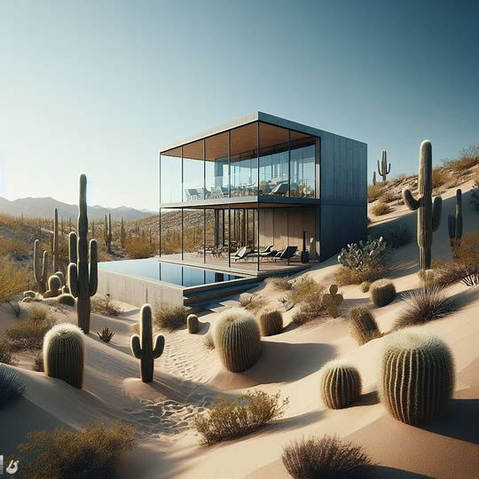
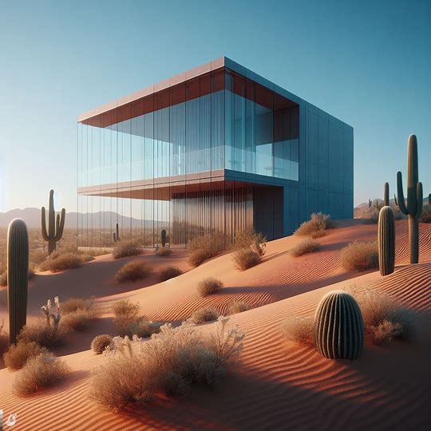
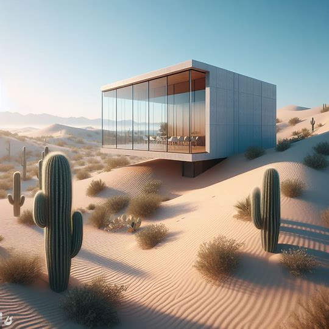
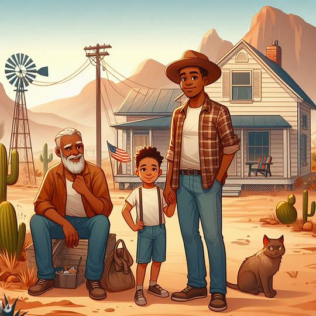
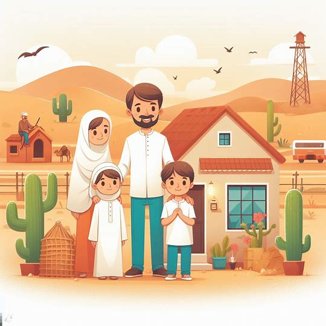
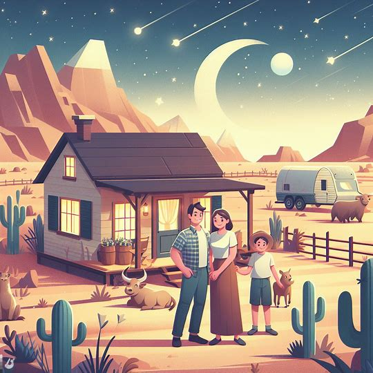
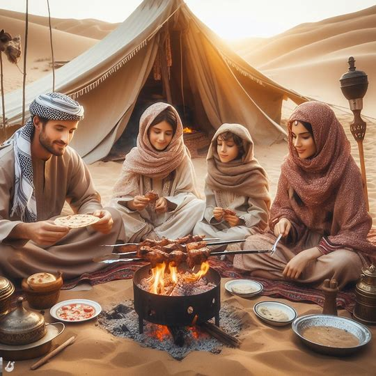
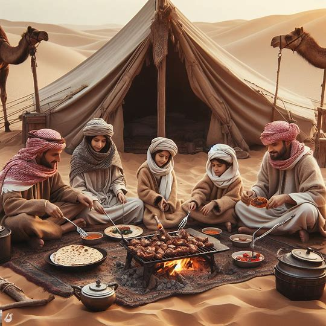
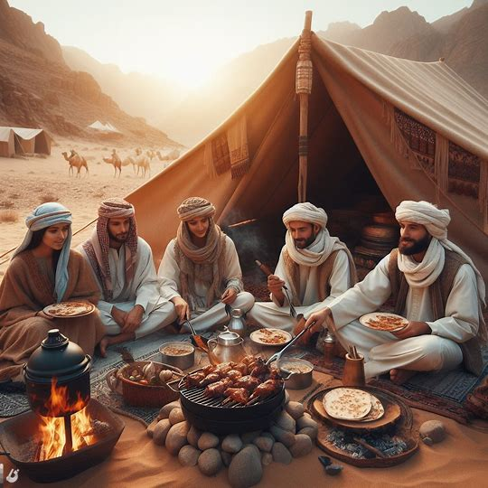

<!DOCTYPE html>
<html lang="en">
<head>
    <meta charset="UTF-8">
    <meta name="viewport" content="width=device-width, initial-scale=1.0">
    <title>Bing Image Creator Results</title>
    
</head>
<body>

I created some photos using Bing Image Creator, and here are the results:

<ul>
    <li></li>
    <li></li>
    <li></li>
    <li></li>
</ul>

At first, I searched for 'A house in a desert.' Later, I updated the search to 'A family living in a house in the middle of a desert,' and these are the results:

<ul>
    <li></li>
    <li></li>
    <li></li>
    <li></li>
</ul>

But I needed something more realistic, so I searched for 'A realistic image of a family living in a desert.'

<ul>
    <li></li>
    <li></li>
    <li></li>
    <li></li>
</ul>

</body>
</html>
